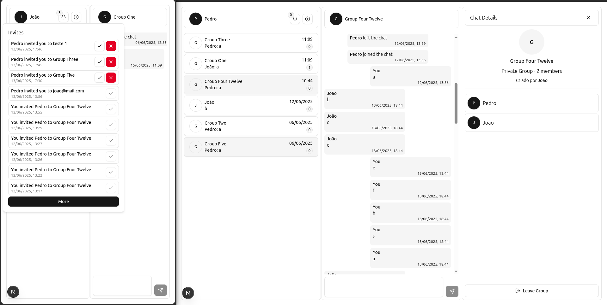

# Socket IO Chat



## Table of Contents
- [Description](#description)
- [Tech and Tools](#tech-and-tools)
- [Installation and Setup](#installation-and-setup)
- [Features](#features)
- [Architecture and Organization](#architecture-and-organization)
- [Common Folders in Modules](#common-folders-in-modules)
- [Shared Subdirectories](#shared-subdirectories)

## Description
A frontend project for practicing real-time chat functionality using React, Next.js, and Socket.IO.

## Tech and Tools
- **React** (v18+): [React Documentation](https://reactjs.org/)
- **Next.js** (v13+): [Next.js Documentation](https://nextjs.org/)
- **Socket.IO Client** (v4+): [Socket.IO Documentation](https://socket.io/)
- **TailwindCSS** (v3+): [TailwindCSS Documentation](https://tailwindcss.com/)
- **Axios** (v1+): [Axios Documentation](https://axios-http.com/)
- **Shadcn**: [shadcn Documentation](https://shadcn.dev/)
- **React Hook Form** (v7+): [React Hook Form Documentation](https://react-hook-form.com/)
- **Zod** (v3+): [Zod Documentation](https://zod.dev/)
- **ESLint** (v8+): [ESLint Documentation](https://eslint.org/)
- **pnpm** (v8+): [pnpm Documentation](https://pnpm.io/)

## Installation and Setup
This project is the frontend part of a fullstack application. To ensure all features work as expected, you need to set up both the frontend and backend. For a seamless experience, refer to the root repository's README for the recommended Docker setup.

1. Clone the repository:
   ```bash
   git clone https://github.com/santanajoao/socket.io-chat.git
   ```

2. Navigate to the frontend directory:
   ```bash
   cd socket-io-chat/frontend
   ```

3. Install dependencies using your preferred package manager:
   - Using **pnpm**:
     ```bash
     pnpm install
     ```
   - Using **npm**:
     ```bash
     npm install
     ```
   - Using **yarn**:
     ```bash
     yarn install
     ```

4. Configure the environment file:
   - Rename the `.env.example` file to `.env`.
   - The example values provided in the file are enough to run the project.

5. Start the development server:
   - Using **pnpm**:
     ```bash
     pnpm dev
     ```
   - Using **npm**:
     ```bash
     npm run dev
     ```
   - Using **yarn**:
     ```bash
     yarn dev
     ```

6. Open your browser and go to `http://localhost:3000` to see the project in action.

## Features
- **Real-time Chat**: Enables real-time communication between users using Socket.IO.
- **Private Chats**: Allows users to initiate one-on-one conversations securely.
- **Global Chats**: Public chat rooms where all users can interact.
- **Group Chats**: Users can create and manage chat groups for specific topics or teams.
- **Invite Users**: Users can invite others to join private or group chats.
- **Group Roles**: Admins can manage participants and assign roles within groups.
- **Group Management**: Admins can update groups details.
- **Notifications**: Real-time notifications for new messages, user joins, and user leaves.

## Architecture and Organization

- **`app/`**: Contains Next.js app routing and global configurations, including pages like `login`, `register`, and the main layout.
- **`modules/`**: Divided into feature-specific modules:
  - **`auth/`**: Handles authentication logic, including APIs, contexts, hooks, schemas, and pages like `Login` and `Register`.
  - **`chats/`**: Manages chat functionality, including components for chat lists, messages, and user interactions, as well as schemas for creating and managing chats.
  - **`invites/`**: Handles invite-related logic, including APIs and types for managing user invitations.
  - **`shared/`**: Contains reusable components (e.g., UI elements), utilities, constants, and shared APIs.
  - **`users/`**: Manages user-related APIs and types, such as user chats and profiles.
  - **`sockets/`**: Manages WebSocket connections and events using Socket.IO.
  - **`helpers/`**: Contains utility functions for formatting, data transformation, and other helper logic.
- **`middleware.ts`**: Middleware for handling server-side logic, such as authentication or request validation.

### Modules common structure
Each module (e.g., `auth/`, `chats/`, `invites/`) follows a similar structure with the following common folders:

- **`apis/`**: Contains API integration logic specific to the module, often using Axios for HTTP requests.
- **`components/`**: Includes reusable UI components specific to the module's functionality.
- **`contexts/`**: Provides React context for managing state and logic shared.
- **`hooks/`**: Custom React hooks for encapsulating logic and state management within the module.
- **`pages/`**: Contains page components for routing and rendering the full page content.
- **`schemas/`**: Defines validation schemas using libraries like Zod for form validation and data consistency.
- **`types/`**: Includes TypeScript type definitions for the module's data structures and API responses.
- **`states/`**: Manages the page or component state using custom hooks separating UI from logic.
- **`sockets/`**: Handles WebSocket connections and events for real-time communication.
- **`helpers/`**: Utility functions for formatting, data transformation, and other helper logic.

### Shared module structure
The **`shared/`** module contains reusable resources shared across the application. Its structure is as follows:

- **`apis/`**: Contains shared API configurations and utilities, such as Axios instances.
- **`components/`**: Includes reusable UI components like buttons, inputs, dialogs, forms, and layout containers.
- **`constants/`**: Stores application-wide constants, such as route definitions or static values.
- **`hooks/`**: Custom React hooks that can be reused across multiple modules, such as loading states or form handling.
- **`lib/`**: Contains shared utility functions for libraries.
- **`types/`**: TypeScript type definitions shared across the application, such as backend response types.
- **`utils/`**: General-purpose utility functions, such as Axios interceptors or data formatters.
